# JobConnect App

## Overview

JobConnect App facilitates connections between customers who need jobs done and companies offering professional services. Customers can create job requests using either a basic or advanced form, while companies can browse, search, and assign jobs. The platform also features a real-time chat system to enable direct communication between the two parties.

User data is managed securely with Keycloak, and communication between services is protected via refresh/access tokens using bearer authentication.

## Features

### For Customers

- **Job Creation**

  - **Basic Form:** Enter a title, select a category, and provide a description.
  - **Advanced Form:** In addition to the basic fields, select a subcategory (filtered based on the selected category), upload images, and specify a budget.
  - **Smart Category/Subcategory Selection:**  
    - When selecting a category, available subcategories are filtered to display only the most relevant options.
    - Customers can search for categories and subcategories directly. If a search term doesn't match an existing entry, an **"Add"** button appears, allowing the user to add their term to their personal category/subcategory list.

- **My Jobs Tab**
  
  - View a list of created job requests.
  - Click the **Detail** button to see all job information, including images and access a real-time chat with the assigned company.

### For Companies

- **Job Browsing and Assignment**
  
  - **All Jobs Tab:**
 
    - View all available jobs that have not yet been assigned.
    - Use a search feature to filter jobs by title, description, category, or subcategory.
  
  - **Job Details:**
    
    - Click the **Detail** button to view job details (chat is not available in this view).
    - Click the **Assign** button to take on a job.

- **My Jobs Tab**
  
  - After assignment, view detailed job information and engage in real-time chat with the customer.

### Security and Logging

- **User Management:** Securely managed via Keycloak.
- **Token-Based Authentication:** Communication is secured using refresh/access tokens; the frontend sends bearer tokens to the backend.
- **Endpoint Protection:** Access is controlled based on user roles, protecting endpoints against unauthorized access.
- **Logging Middleware:** All requests and responses are logged for traceability and debugging.

## Architecture

The application is composed of several microservices and containerized components:

- **job-control:** Handles job creation, retrieval, and management.
- **frontend:** The user interface built with Vue.js and Vuetify.
- **images:** Manages image uploads and storage.
- **chat:** Provides real-time chat functionality between customers and companies.

Additional containers include:

- **MongoDB:** NoSQL database for storing job and user-related data.
- **Keycloak:** Identity and access management service for secure user authentication.

## Technologies

- **Vue.js & Vuetify:** Frontend framework and UI library for a responsive and user-friendly interface.
- **Docker:** Containerization of the microservices for consistent deployment.
- **MongoDB:** NoSQL database for data storage.
- **Keycloak:** For secure user management and authentication.

## Getting Started

### Prerequisites

- [Docker](https://www.docker.com/get-started) installed on your system.
- [Docker Compose](https://docs.docker.com/compose/) for orchestration.
- [Compass](https://www.mongodb.com/try/download/compass) for MongoDB management.

### Installation

1. **Clone the Repository**

    ```bash
    git clone https://github.com/jirisuster/jobconnect.git
    cd jobconnect
    ```

2. **Build and Run the Application**

    If you're using Docker Compose, run:

    ```bash
    docker-compose up --build
    ```

3. **Import Keycloak Realm**

    Open your browser and navigate to:

    ```
    http://localhost:8091
    ```

    Log in with the default credentials:
    
    - **Username:** `admin`
    - **Password:** `1234`
    
    Then:
    
    - Click on **Create New Realm**
    - Import the realm from `import/KeyCloak/realm-export-docker.json`
    - Create users and assign them roles (customer/company)

4. **Import Example Categories**

    Open MongoDB Compass and connect to `localhost:27018`
    
    - In the `category` collection, import `import/MongoDB/jobs_app.category.json`
    - In the `subcategory` collection, import `import/MongoDB/jobs_app.subcategory.json`

5. **Access the Application**

    Open your browser and navigate to:

    ```
    http://localhost:5002
    ```

## Usage

- **For Customers:**
  - Navigate to the **Add Job** tab.
  - Choose between the basic or advanced job creation form.
  - When selecting categories, the subcategories are dynamically filtered based on your choice, showing only the most relevant options. You can also search for a category or subcategory directly; if no match is found, an **"Add"** button appears to let you add your own entry.
  - View your created jobs in the **My Jobs** tab. Click **Detail** to see the full job information, including images and a real-time chat with the assigned company.

- **For Companies:**
  - Browse available jobs in the **All Jobs** tab.
  - Use the search functionality to filter jobs by title, description, category, or subcategory.
  - Click **Detail** to view job information (without chat) and assign the job using the **Assign** button.
  - Once assigned, the job will appear in the **My Jobs** tab, where you can view details and engage in chat with the customer.

## Screenshots

### Customer

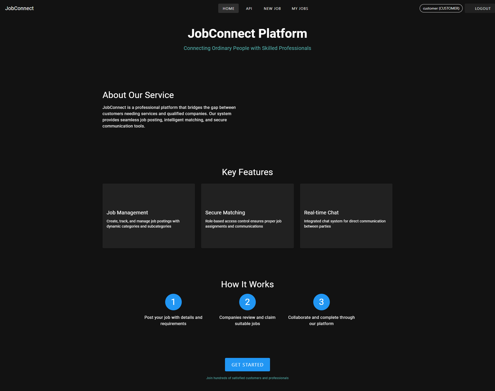
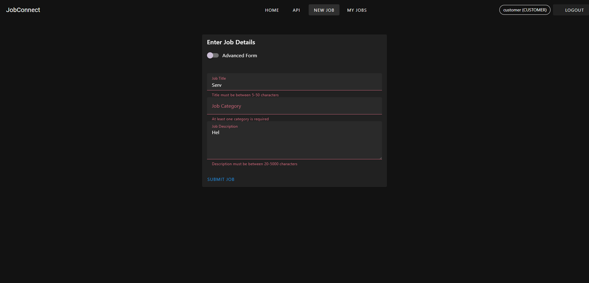
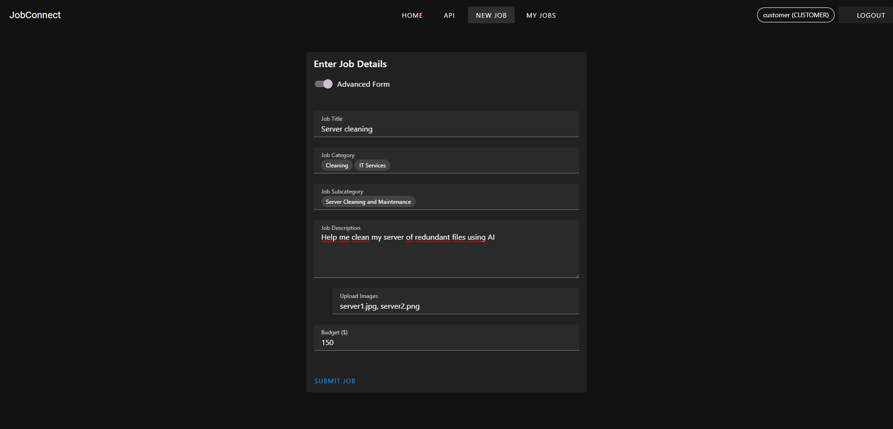
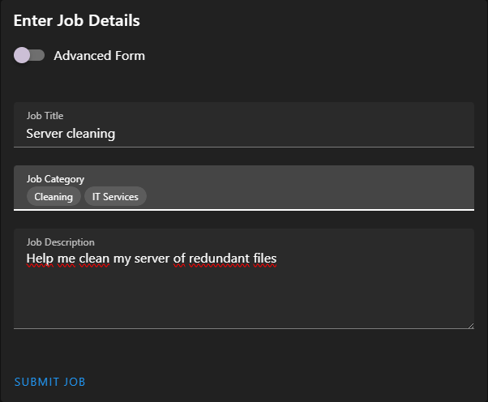
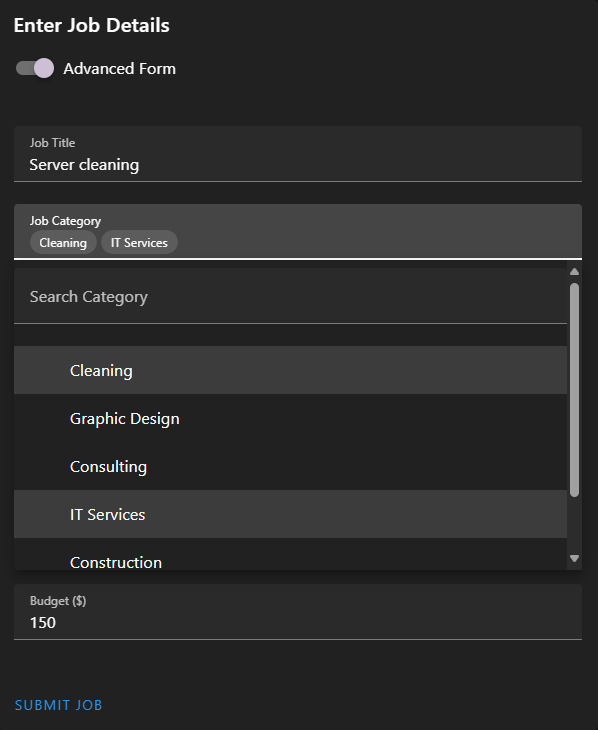
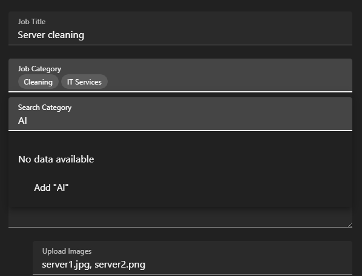
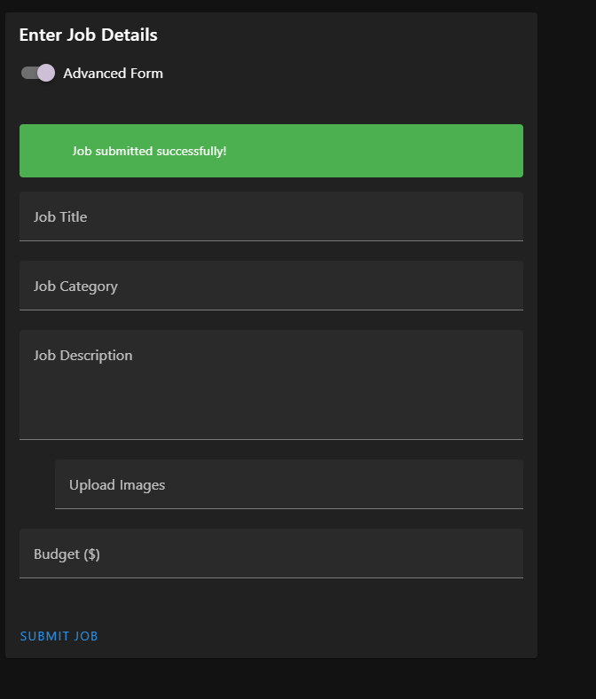
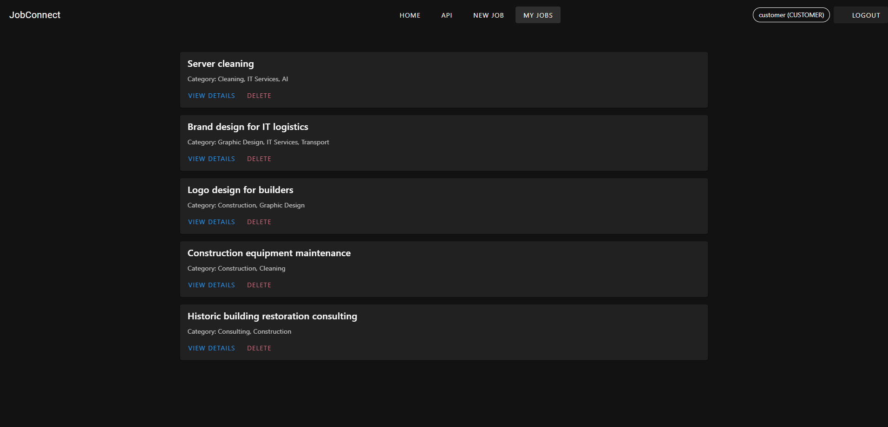
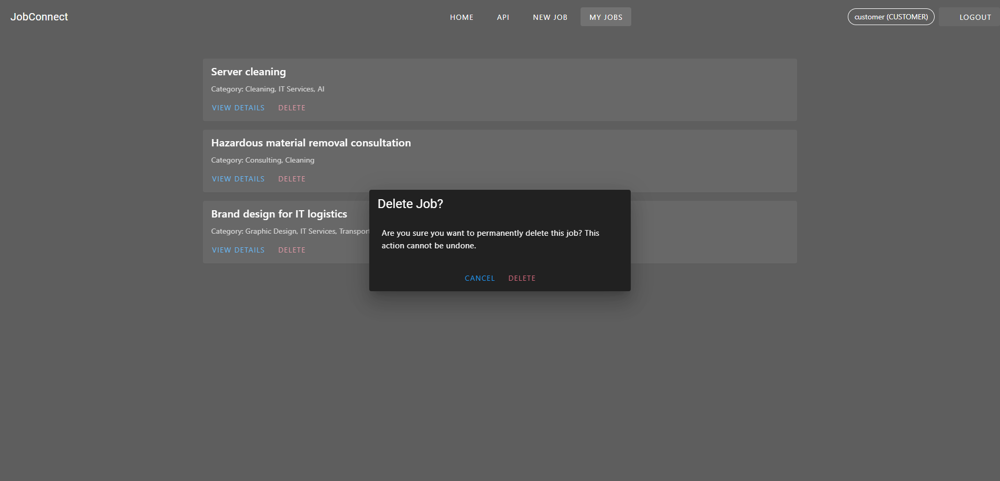

### Company

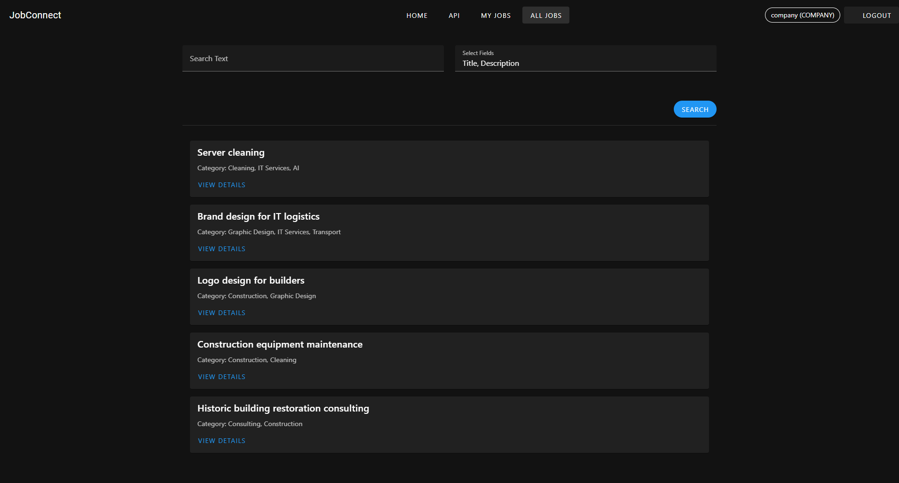
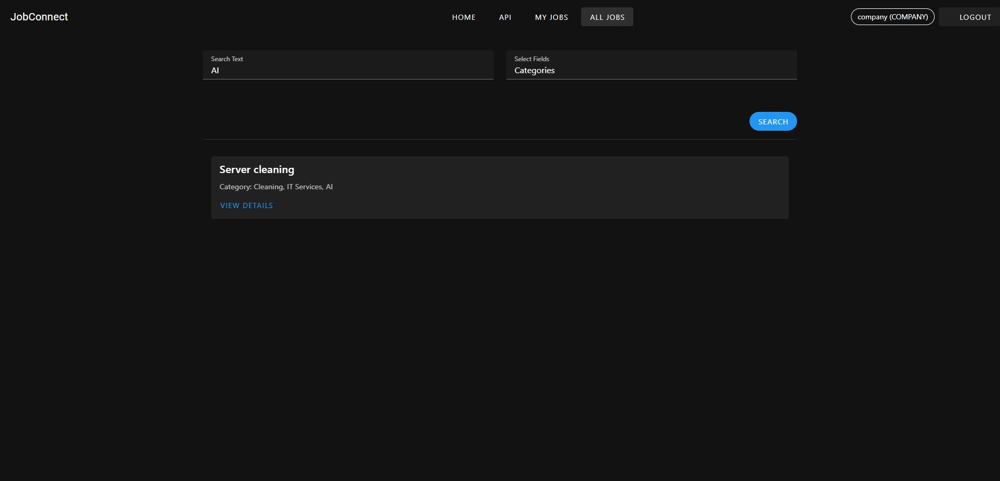

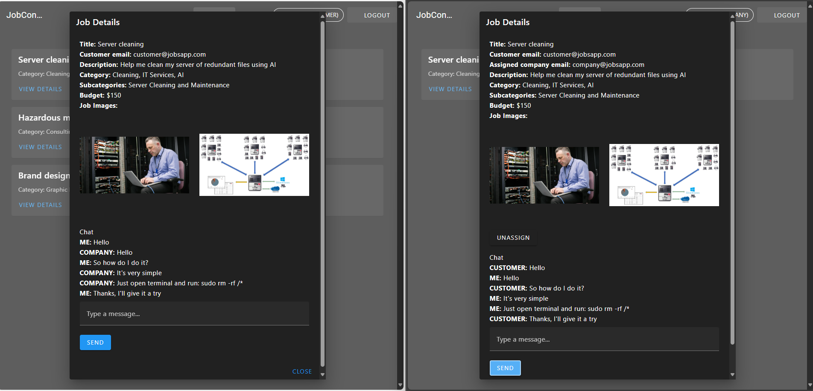

## Author
### mchyasn
