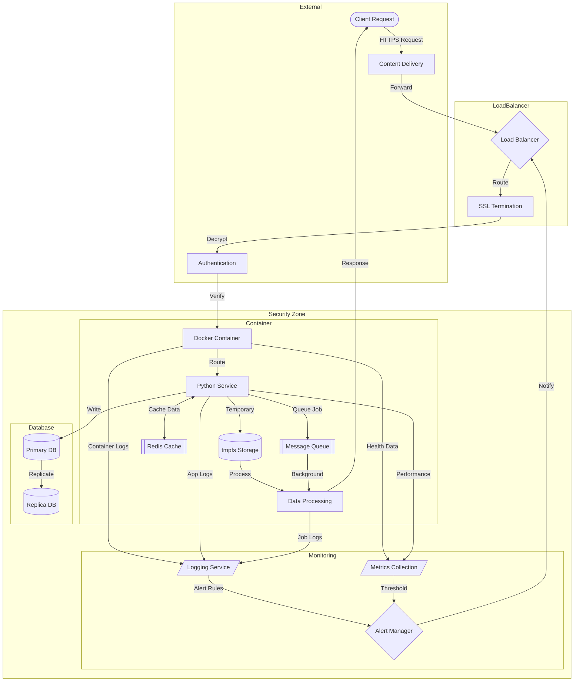

# Docker In-Memory Storage Implementation


## Overview

### This project demonstrates my implementation of secure in-memory storage using Docker containers with tmpfs mounts. Through this journey, I've explored handling sensitive configuration files, such as private keys and API credentials, ensuring they never touch the disk. The project showcases my understanding of container security best practices and memory-based filesystem management.

## Technical Architecture

The project implements a microservice-based approach using Docker containers with tmpfs mounts for secure in-memory storage. Here's the high-level architecture:



## Technical Stack

- **Container Platform**: Docker
- **Programming Language**: Python 3.9
- **Base Image**: python:3.9-slim
- **Storage**: tmpfs (memory-based filesystem)
- **File System**: Alpine Linux

## Key Features

1. Secure In-Memory Storage
   - tmpfs mount implementation
   - Memory-based file system configuration
   - Secure data handling

2. Docker Configuration
   - Custom Dockerfile setup
   - Container security measures
   - Resource limitation controls

3. Python Microservice
   - Secure file operations
   - Error handling
   - Memory management

4. Security Features
   - No disk persistence
   - Isolated storage space
   - Access control implementation

5. Performance Optimization
   - Memory-only operations
   - Efficient resource usage
   - Quick data access

## Learning Journey

### Technical Mastery:

1. Docker container configuration and security
2. Memory-based filesystem implementation
3. Microservice architecture design
4. Secure data handling practices
5. Resource management and optimization

### Professional Development:

1. Security-first thinking
2. Documentation best practices
3. Problem-solving with containerization
4. System architecture design
5. Performance optimization techniques

## Future Enhancements

<details>
<summary>View Planned Improvements</summary>

1. Implement multiple tmpfs mounts for different security levels
2. Add monitoring and logging capabilities
3. Develop automated testing suite
4. Implement data encryption at rest
5. Add horizontal scaling capabilities
6. Enhance error handling and recovery
</details>

## ⚙️ Installation

<details>
<summary>View Installation Details</summary>

### Prerequisites

- Docker installed on your system
- Python 3.9 or higher
- Basic understanding of containerization

### Setup Steps

1. Clone the repository:
```bash
git clone https://github.com/TheToriqul/docker-in-memory-storage.git
cd docker-in-memory-storage
```

2. Build the Docker image:
```bash
docker build -t my_microservice .
```

3. Run the container:
```bash
docker run --rm -d \
    --mount type=tmpfs,dst=/app/tmp,tmpfs-size=16k,tmpfs-mode=1770 \
    my_microservice
```

</details>

##  Usage Guide

<details>
<summary>View Usage Details</summary>

### Basic Usage

The microservice automatically handles sensitive data in memory. To verify the setup:

1. Check container status:
```bash
docker ps
```

2. Inspect tmpfs mount:
```bash
docker inspect <container_id>
```

### Troubleshooting

- Ensure tmpfs mount is properly configured
- Verify memory allocation is sufficient
- Check container logs for any errors
